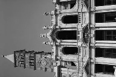
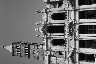
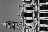
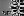
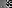
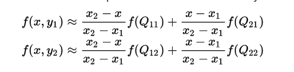
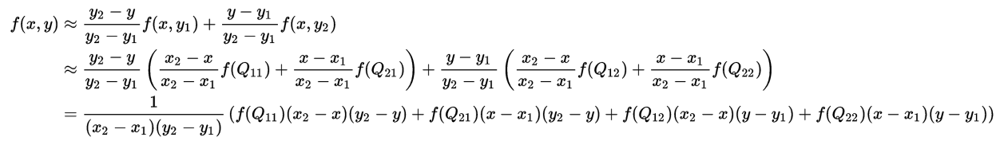
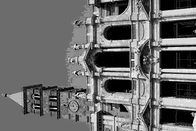
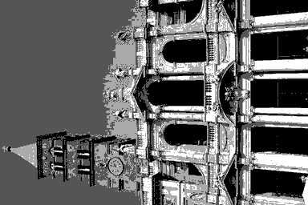
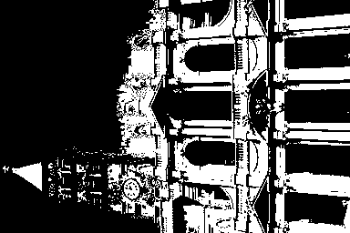

# Exercises

## Storage

1. 8 bit planes for this gray image, since 256 = 2 ^ 8.
2. plane *N*, which is the highest-order bit plane, should be the most visually significant one.
3. 2048 x 2048 bytes, 1 byte(8 bits) per pixel.

Reference: [https://en.wikipedia.org/wiki/Bit_plane](https://en.wikipedia.org/wiki/Bit_plane)

## Adjacency

1. The 4-path does **not** exist. Because the 4-neighbors of q are {0, 4, 4}, and none of them belongs to V, that means the 4-path which contains q does not exist in the image.
2. The length of the shortest 8-path is **4**. By using the Breadth-first search Algorithm, the shorest path should be (3, 0), (2, 1), (2, 2), (2, 3), (1, 4).
3. The length of the shortest m-path is **5**. The path is (3, 0), (2, 0), (2, 1), (2, 2), (2, 3), (1, 4)

References: [https://sites.google.com/site/assignmentssolved/mca/semester6/mc0086/2](https://sites.google.com/site/assignmentssolved/mca/semester6/mc0086/2), course PPT(chapter 2's 2.5)

## Logical Operations

1. (A)AND(B)AND(C)AND{NOT\[(B)AND(C)\]}
2. \[(A)AND(B)AND(C)\] OR \[(A)AND(B)\] OR \[(A)AND(C)\]
3. {(B)AND\[NOT\[(A)OR(C)\]\]} OR {(A)AND(C)AND\[NOT\[(A)AND(B)AND(C)\]\]}

Reference: course PPT(chapter 2's 2.6)

# Programming Tasks

## Scaling

* **Down-scale to 192 × 128 (width: 192, height: 128), 96 × 64, 48 × 32, 24 × 16 and 12 × 8,hen manually plot your results in the report.**

 
scale_192_128_72.png

 
scale_96_64_72.png

 
scale_48_32_72.png

 
scale_24_16_72.png

 
scale_12_8_72.png

* **Down-scale to 300 × 200, then plot your result.**

 
scale_300_200_72.png

* **Scale to 500 × 200, then plot your result.**

 
scale_500_200_72.png

* **Detailedly discuss how you implement the scaling operation**

I start by calculate the (old_x, old_y) as (new_x/x_scale, new_y/y_scale), where x_scale and y_scale means new_height/old_height and new_width/old_width respectively. That means I try to find the point of the new image from the old one. So if old_x or old_y is an integer, then just apply it to the new image. 
But if neither old_x nor old_y is an integer, then scaling operation is implemented by using **bilinear interpolation**, which goes like following: 
Suppose that we want to find the value of the unknown function f at the point (x, y). It is assumed that we know the value of f at the four near points Q11 = (x1, y1), Q12 = (x1, y2), Q21 = (x2, y1), and Q22 = (x2, y2). 
We first do linear interpolation in the x-direction. This yields 
 
We proceed by interpolating in the y-direction to obtain the desired estimate: 
 
So for every pixel which not exist in the old image, I find the four near points of it from the old image, and then calcultate the value by using the above formula. 
So how to find the near four points? I just set x1 as floor(old_x) while x2 as ceil(old_x) and so for y1 and y2. Note that when old_x or old_y is an integer, the formula will be 0, that's not what I expect, and that's why I do it only when old_x and old_y are both not integer.

## Quantization

* **Result images**

 
quantize_128_72.png

 
quantize_32_72.png

 
quantize_8_72.png

 
quantize_4_72.png

 
quantize_2_72.png

* **Discuss**

The quantization algorithm is easy, which goes like: 
For every pixel in the new image, set it as `scale * (old / diff)`, where `scale` means `255 / (level - 1)`, `old` means the gray value in the original image and `diff` means `256 / level`. The `scale` is used to meet the rule of the computer which always represent “white” via the pixel value of 255.
