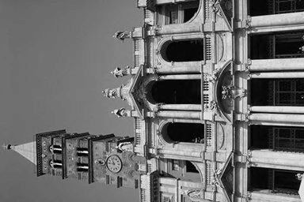
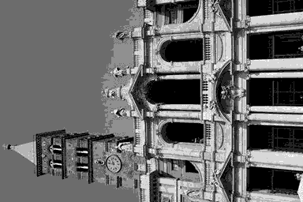
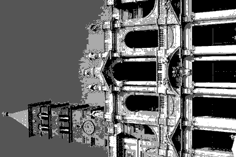
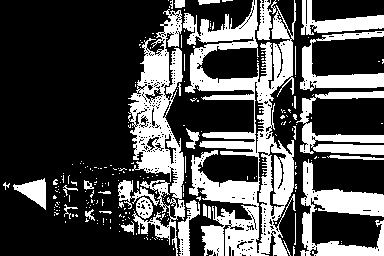

# HW1: Fundamentals

## 1 Exercises

### 1.1 Storage

**1.1.1** 7个位平面（$128 = 2^7$)。 
**1.1.2** 最高位的平面，即第7个位平面。 
**1.1.3** 总共需要 $1024\times2048\times7\div8=1835008$ 字节(bytes)来存储这个图像。

### 1.2 Adjacency

**1.2.1** **不存在**从p到q的4连通。原因：像素的q的4邻接集合是{0, 4, 4}，它们全都不属于集合$V$。 
**1.2.2** 最短的8连通为**4**。使用广度优先搜索，可以得知最短路是`(3, 0), (2, 1), (2, 2), (2, 3), (1, 4)`。 
**1.2.3** 最短的m连通为**5**。该连通为`(3, 0), (2, 0), (2, 1), (2, 2), (2, 3), (1, 4)`。

### 1.3 Logical Operations

**1.3.1**
$$(A)AND(B)AND(C)AND\{NOT[(B)AND(C)]\}$$
**1.3.2**
$$[(A)AND(B)AND(C)] OR [(A)AND(B)] OR [(A)AND(C)]$$
**1.3.3**
$$\{(B)AND[NOT[(A)OR(C)]]\}OR\{(A)AND(C)AND[NOT[(A)AND(B)AND(C)]]\}$$

# 2 Programming Tasks

## 2.2 Scaling

**2.2.2 Down-scale to 192 × 128 (width: 192, height: 128), 96 × 64, 48 × 32, 24 × 16 and 12 × 8,then manually plot your results in the report.**

 
scale_192_128_72.png

 
scale_96_64_72.png

 
scale_48_32_72.png

 
scale_24_16_72.png

 
scale_12_8_72.png

**2.2.2 Down-scale to 300 × 200, then plot your result.**

 
scale_300_200_72.png

**2.2.3 Scale to 500 × 200, then plot your result.**

 
scale_500_200_72.png

**2.2.4 Detailedly discuss how you implement the scaling operation**

将要求缩放到的尺寸定义为(new_height, new_width), 而图像的原始尺寸定义为(old_height, old_width), 那么图像的缩放倍数就是(new_height/old_height, new_width/old_width)=(x_scale, y_scale)。那么，我们可以假定已经得到了缩放后的新图像，然后通过缩放倍数，计算新图像中的每一个像素在原来图像中对应的位置。也就是(new_x/x_scale, new_y/y_scale)=(old_x, old_y)，如果old_x或者old_y是一个整数，那么，就直接将该点对应的像素值作为新图像的像素值。 
对于old_x以及old_y都不是整数的情况，那么就使用双线性内插（**bilinear interpolation**）算法来计算出像素值。具体方法如下： 
我们要求(x, y)点的像素值，假设我们知道了该点的四个最近点的像素值
$Q_{11} = (x_1, y_1)$, $Q_{12} = (x_1, y_2)$, $Q_{21} = (x_2, y_1)$, 以及 $Q_{22} = (x_2, y_2)$。 
我们可以先做x轴方向上的线性内插，对于行 $y_1$ 得到如下结果 
$$
f(x, y_1)=f(Q_{11})+ \frac{x-x_1}{x_2-x_1}(f(Q_{21})-f(Q_{11}))\\
f(x, y_1)=\frac{x_2-x}{x_2-x_1}f(Q_{11})+\frac{x-x_1}{x_2-x_1}f(Q_{21})
$$
同理，对于行 $y_2$ 得到如下结果
$$
f(x, y_2)=\frac{x_2-x}{x_2-x_1}f(Q_{12})+\frac{x-x_1}{x_2-x_1}f(Q_{22})
$$
然后，再做y轴方向的线性内插，可以得到 
 
在程序的实现中，四个临近点采用对于old_x取天花板数和地板数，对old_y取天花板数和地板数来得到。

## 2.3 Quantization

**2.3.1 Result images**

 
quantize_128_72.png

 
quantize_32_72.png

 
quantize_8_72.png

 
quantize_4_72.png

 
quantize_2_72.png

**2.3.2 Discuss**

量化算法相对简单，方法如下： 
对于图像中的每个像素，将其更新为`scale * (old / diff)`，其中，`scale`代表`255 / (level - 1)`， `old`代表原始图像中该像素的灰度值，`diff`代表`256 / level`。其中`scale`作为一个缩放因子，用来使图像符合python中PIL库对于图像的显示规则，该库使用255来代表白色，0代表黑色。
