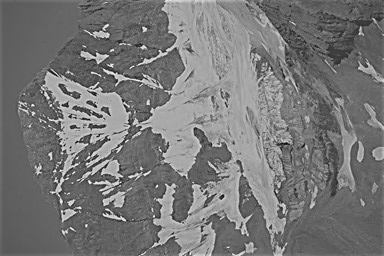

# HW2: Histogram and Spatial Filtering

## 1 Exercises

### 1.1 Histogram Equalization

**Yes**, it will. 
The histogram equalizaiton transformation can be expressed as
$$
s_k = T(r_k) = \sum_{j=0}^{k}n_{r_j}/n = \frac{1}{n}\sum_{j=0}^{k}n_{r_j}
$$
where $n=MN$ is the total number of pixels, and $n_{r_j}$ is the number of pixels in the input image with intensity value $r_j$. 
According to the formula shown above, we know that every pixel with value $r_k$ will be mapped to value $s_k$.So after the first pass, we would have $n_{s_k} = n_{r_k}$.Supposed the second pass of histogram equalization $s_k$ would produce value $v_k$, then accroding to the equation, we would have
$$
v_k = T(s_k) = \frac{1}{n}\sum_{j=0}^{k}n_{s_j}
$$
since $n_{s_j} = n_{r_j}$, it yield
$$
v_k = T(s_k) = \frac{1}{n}\sum_{j=0}^{k}n_{s_j}=\frac{1}{n}\sum_{j=0}^{k}n_{r_j} = s_k
$$
That means a second pass of histogram equalization would yield the same result as the first pass. *Note that here we have assumed to ignore round-off errors*

### 1.2 Spatial Filtering

* **1.2.1 Convolve the gray image with the given filter with zero-padding, and show your result**
$$
\begin{bmatrix}
    177  & 420  & 279  & 271 \\
    74   & 72   & 90   & -52 \\
    -61  & -131 & -2   & -19 \\
    -172 & -199 & -215 & -60
\end{bmatrix}
$$

* **1.2.2 Discuss the meanings of positive values and negative values in your convolution result
respectively**

Positive values mean that the grey value on the top of the center pixel is smaller than the bottom ones, while negative means the opposite way.

* **1.2.3 Describe some applications of the given filter based on your own knowledge.**

It can be used to find the edge of the image in the horizontal direction

## 2 Programming Tasks

### 2.2 Histogram Equalization

* **2.2.1 Compute and display its histogram.**

* **2.2.2 Equalize its histogram.**

* **2.2.3 Analyze your histogram-equalized result**

The histogram equalized result is a little bit clear visually. Some details are exposed expecially on the top of the mountain shown in the image. **However**, the result is not that better as I have imaged, and the result seems **unnatural** to some extend.

* **2.2.4 Detailedly discuss how you implement the histogram equalization operation.**

The "equalize hist" function is implemented by the following three step:

1. Count up the number of per gray level value, store than in a list, where index is gray level value and the value is the number.
2. Calculate cummulative distribution, walk through the list get in step 1, for every position, set the value as the sum of all the value before it, and then divide it by the total pixel number of the image, and store it in another list.
3. Map the original gray level value to the list value got in step 2, and multiply it by 255 according to the way python displays image.

The histogram is displayed by using **bar chart**, where x is set as `range(256)` and y is set as the list got from step 1 shown above. And the bar chart can be shown by using `matplotlib.pyplot.bar` in python.

### 2.3 Spatial Filtering

* **Smooth image with average filter**

* **Sharpen image with laplacian filter**

* **High-boost filtering**

k = 1.3

* **Discussion about implement**

The filter operation itself is easy to implement, just by simply rotate the filter to 180 degree, and then pad the image with 0 with the length of `filter_len / 2`, and then apply filter to every path of the image. That's it. 
However, to display the image in the proper way really takes a lot of time. Until now I still cannot not find the right way to do linear stretch. 
