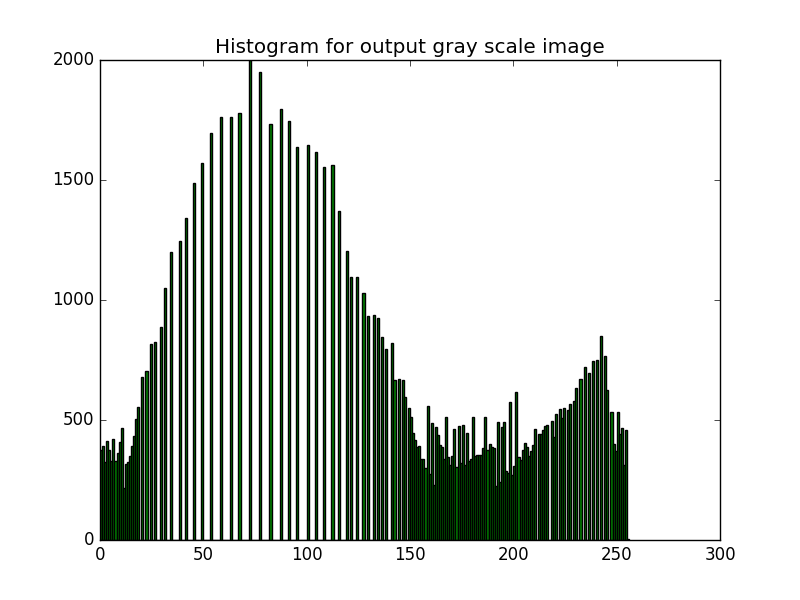
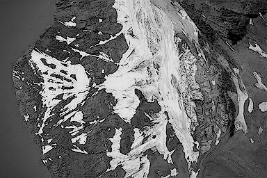

# HW2: Histogram and Spatial Filtering

## 1 Exercises

### 1.1 Linearity

直方图均衡化**不是**一个线性操作。 
直方图均衡化的变换可以表示为：
$$
s_k = T(r_k) = \sum_{j=0}^{k}n_{r_j}/n = \frac{1}{n}\sum_{j=0}^{k}n_{r_j}
$$
其中 $n=MN$ 指的是图像的像素总数， $n_{r_j}$ 指的是像素值为 $r_j$ 的像素的个数。 
而一个线性操作 $L$, 对于任意一对变量 $f$ 和 $g$ 以及标量 $t$ , 需要满足以下两个性质：

1. $L(f + g) = L(f) + L(g)$
2. $L(tf) = tL(f)$

不难证明，直方图均衡化的变换不满足上述的任一个性质，所以直方图均衡化不是一个线性操作。

### 1.2 Spatial Filtering

**1.2.1** 
$$
\frac{1}{16}\times
\begin{bmatrix}
    15  & 25 & 25 & 15 \\
    25  & 40 & 40 & 25 \\
    25  & 40 & 40 & 25 \\
    15  & 25 & 25 & 15
\end{bmatrix}
$$
**1.2.2** 
当对图像应用足够多次的该滤波器的滤波之后，图像的所有像素值将**变为0**，也就是图像会变为一张纯黑色的图像。 
对于每一次的滤波，每个像素值会变为： 
$$
f_{center} = \frac{1}{16}\times \sum_{j=0}^{8} w_if_i
$$
其中 $w_i$ 指的是滤波器的权值， $f_i$ 指的是图像的像素值。 
通过多次的应用该滤波器，可以发现像素值的加权和除以16得到的结果会逐步减小并趋向于零，当n取无穷大(limiting value)时，最终得到的每个像素值都会变为 $0$。 
**1.2.3** 
卷积操作之前需要先对滤波器翻转180度，而相关操作不需要。 
卷积操作满足结合律，而相关操作则不满足。我们知道，在频率域中，卷积操作就是乘法运算，显然满足结合律，而相关操作则是复共轭（complex conjugate）的乘法，显然不满足结合律。 
**1.2.4** 
该滤波器是一个低通滤波器，可以用来模糊图像，起去噪效果。

## 2 Programming Tasks

### 2.2 Histogram Equalization

**2.2.1 Compute and display its histogram.**

**2.2.2 Equalize its histogram.**

**2.2.3 Analyze your histogram-equalized result**

二次均衡化后的结果与一次均衡化的**结果一致**。 
原因：直方图均衡化变换可以表示为：
$$
s_k = T(r_k) = \sum_{j=0}^{k}n_{r_j}/n = \frac{1}{n}\sum_{j=0}^{k}n_{r_j}
$$
其中 $n=MN$ 指的是图像的像素总数， $n_{r_j}$ 指的是像素值为 $r_j$ 的像素的个数。 
根据上述的公式，我们知道在一次均衡化之后，对于值为 $r_k$ 的像素将会被映射为 $s_k$ 。所以，经过一次均衡化后，我们有 $n_{s_k} = n_{r_k}$ 。假设经过第二次均衡化， $s_k$ 会被映射为
$v_k$ ， 那么，根据上述公式，我们可以得到
$$
v_k = T(s_k) = \frac{1}{n}\sum_{j=0}^{k}n_{s_j}
$$
由于 $n_{s_j} = n_{r_j}$ ，所以有
$$
v_k = T(s_k) = \frac{1}{n}\sum_{j=0}^{k}n_{s_j}=\frac{1}{n}\sum_{j=0}^{k}n_{r_j} = s_k
$$
这意味着第二次均衡化后的结果与第一次的结果完全相同。 *注意： 这里的证明我们忽略了round-off误差*

**2.2.4 Detailedly discuss how you implement the histogram equalization operation.**

"equalize hist"函数的实现大致包括如下三步：

1. 计算图像中每个灰度值包含的像素个数，并将其保存在一个list中，其中，list的下标指的是灰度值，值代表了该灰度值的像素个数。
2. 计算累积分布。遍历步骤1中得到的list，对于其中的每个位置，计算该位置之前的所有元素的值的总和，然后，将每个位置中的数除以图像的像素数，并将得到的结果保存在另一个list中。
3. 将原始图像中的灰度值映射为步骤2中的list对应下标所对应的值。然后，再将得到的结果乘以255使其符合PIL库对于图像的表示。

直方图使用 **bar chart** 来表示，其中x轴的值设置为`range(256)`，y轴的值设置为步骤1中得到的值。而对于 bar chart 的显示，本程序调用了python中 `matplotlib.pyplot.bar` 这个接口。

### 2.3 Spatial Filtering

**2.3.1 Smooth image with average filter**

**2.3.2 Sharpen image with laplacian filter**

**2.3.3 High-boost filtering**

k = 1.5

**2.3.4 Discussion about implement**

卷积操作的实现相对简单。只需将滤波器旋转180度（在numpy中，可以使用np.rot90函数，对矩阵做两次90度的旋转即可），然后对图像的边缘补上长度为`filter_len / 2`的0（在实现过程中其实可以不用补0，只需判断所需位置是否在图像边界外，是则将其置为0，因为补0本身没有多大意义，但却会带来空间开销），最后，将滤波器从左到右，从上到下地应用于图像矩阵上，即可得到。 
另外，在PIL库中，用于构建图像的数组必须是np.uint8类型的，即unsigned int8，范围是[0, 255]。但在对图像进行操作时，我们必须使用float类型来保证运算的精度，所以，最后需要将数组转换为np.uint8。**但是**，用numpy数组中的astype函数来转换成np.uint8是会有wrap的问题的，比如说，它会把265变为9，即(265 -256)。这不符合我们所想要的结果，图像操作最终希望的是staurate(max=255)或者truncate(min=0)，所以，我们需要先使用clip函数将“溢出”的值直接变为255或者0，然后再进行类型转换。这一步在PIL中**非常关键**。
