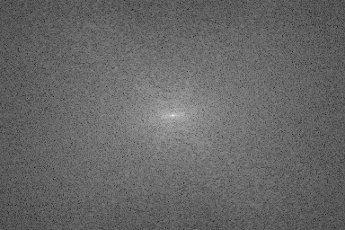
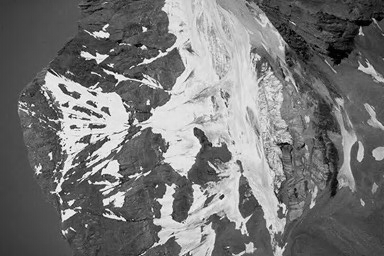
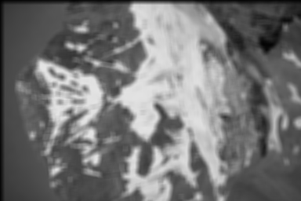
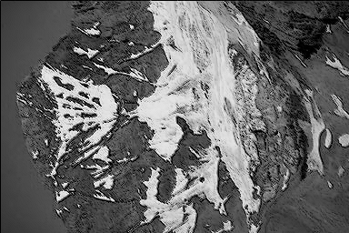

# HW3: Filtering in the Frequency Domain

## Exercises

### 1.1 Rotation

The complex conjugate simply changes $j$ to $−j$ in the inverse transform, so the image on the right is given by
$$
\begin{align}
\mathscr{F}^{-1}[F^*(u, v)] &= \sum_{x=0}^{M-1}\sum_{y=0}^{N-1}F(u, v)e^{-j2\pi(ux/M+vy/N)} \\
&=\sum_{x=0}^{M-1}\sum_{y=0}^{N-1}F(u, v)e^{j2\pi(u(-x)/M+v(-y)/N)} \\
&=f(-x, -y)
\end{align}
$$
which simply mirrors $f(x, y)$ about the origin, thus producing the image on the right.

### 1.2 Fourier Spectrum

* 在周围加上了黑色背景，使得图像的均值相比原来的图像小，FT得到的DC值就会变小，所以FT Spectrum的中心点应该会相对暗一点
* 而黑色背景与原图在水平方向和垂直方向上的交界处，会产生高频信息，所以对应的在FT Spectrum上的垂直方向和水平方向上分别多出了一条白色的边

### 1.3 Lowpass and Highpass

* **Find $H(u, v)$**

$$
g(x, y) = f(x-1,y-1)+2f(x-1,y)+f(x-1,y+1)\\
-f(x+1,y-1)-2f(x+1,y)-f(x+1,y+1)
$$
From property 3 in Table 4.3
$$
\begin{align}
G(u,v)&=F(u,v)(e^{-2j\pi(u/M+v/N)}+2e^{-2j\pi(u/M)}+e^{-2j\pi(u/M-v/N)}\\
&-e^{-2j\pi(-u/M+v/N)}-2e^{-2j\pi(-u/M)}-e^{-2j\pi(-u/M-v/N)})\\
&=F(u,v)(e^{-2j\pi u/M}-e^{2j\pi u/M})(e^{-2j\pi v/N}+2+e^{2j\pi v/N})\\
&=F(u,v)(-2jsin(2\pi u/M)(2cos(\pi v/N))^2)\\
&=F(u,v)(-4jsin(2\pi u/M)(cos(2\pi v/N)+1))\\
&=F(u,v)H(u,v)
\end{align}
$$
where $H(u,v)$ is the filter function:
$$
H(u,v)=-4jsin(2\pi u/M)(cos(2\pi v/N)+1)
$$
<br>

* **Is $H(u, v)$ a low-pass filter or a high-pass filter?**

$H(u, v)$ is a high-pass filter.

## 2 Programming Tasks

### 2.2 Fourier Transform

* **Perform DFT**

<br>
I did try all of my best to improve the Fourier Transformation, but it still take times, the Spectrum above takes about 10s in my machine to generate.

* **Perform IDFT**

<br>
After fixing the imaginary calculation error, the final idft image is near the same as input image

* **Detailedly discuss how you implement DFT / IDFT**

Just follow the formula, but remmeber to try using vector operation and multiprocessing operation, because the calculation really take times for every point would use all the pixel of the input image as input.

### 2.3 Bonus: Fast Fourier Transform

* **Perform FFT**

<br>
Resize the original image to 256x256

<br>

* **Perform IFFT**

<br>

* **Detailedly discuss how you implement FFT / IFFT**<br>
Reference:<br> [https://jakevdp.github.io/blog/2013/08/28/understanding-the-fft/](https://jakevdp.github.io/blog/2013/08/28/understanding-the-fft/)<br>
[http://math.stackexchange.com/questions/77118/non-power-of-2-ffts](http://math.stackexchange.com/questions/77118/non-power-of-2-ffts)<br>
[http://stackoverflow.com/questions/11333454/2d-fft-using-1d-fft](http://stackoverflow.com/questions/11333454/2d-fft-using-1d-fft)

### 2.4 Filtering in the Frequency Domain

* **Smooth image by using average filter**

<br>

* **Sharped image by using Laplacian filter**

<br>

* **Detailedly discuss how you implement filter operation**

*I implement filter operation by using the np.fft.fft2 in order to save time*

```sh
* step 1: get padding params

* step 2: pad Image

* step 3: center transform

* step4: image dft

* step5: form freq filter and Perform array multiplication
* step5.1 pad filter
* step5.2 center filter
* step5.3 get frequency filter through DFT
* step5.4 Perform array multiplication

* step6: obtain processed image

* step7: extract top left part
```
