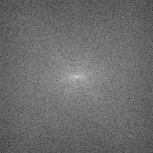
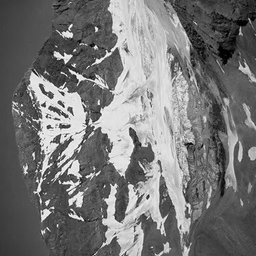
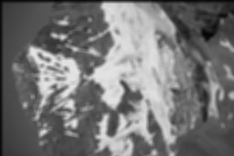

# HW3: Filtering in the Frequency Domain


## 1 Exercises

### 1.1 Rotation

对图像乘以 $(-1)^{x+y}$ 只是为了将频谱域中的低频信号移动到图像的中间，最后一步则是为了恢复，所以，这两步是在做傅里叶变换时使用的技巧性操作，不影响结果。<br>
变换中最关键的一步，就是**第三步**，对离散傅里叶变换得到的结果取复共轭。我们知道，离散傅里叶反变换的公式如下：
$$
f(x, y) = \sum_{u=0}^{M-1}\sum_{v=0}^{N-1}F(u, v)e^{j2\pi(ux/M+vy/N)}
$$
所以，在反变换中，取复共轭就是把公式右边的 $j$ 替换为 $-j$，因此，有
$$
\begin{align}
\mathscr{F}^{-1}[F^*(u, v)] &= \sum_{u=0}^{M-1}\sum_{v=0}^{N-1}F(u, v)e^{-j2\pi(ux/M+vy/N)} \\
&=\sum_{u=0}^{M-1}\sum_{v=0}^{N-1}F(u, v)e^{j2\pi(u(-x)/M+v(-y)/N)} \\
&=f(-x, -y)
\end{align}
$$
取复共轭之后，反变换得到的结果为 $f(-x, -y)$，也就是将原来的图像 $f(x, y)$ 关于原点做镜像变换，得到的结果就是右图旋转180度的图像。

### 1.2 Fourier Spectrum

* 在周围加上了黑色背景，使得图像的均值相比原来的图像小，FT得到的DC值就会变小，所以FT Spectrum的中心点应该会相对暗一点
* 而黑色背景与原图在水平方向上的交界处，会产生高频信息，所以对应的在FT Spectrum上的垂直方向上分别多出了一条白色的边。同理，垂直方向上的交界会产生水平方向的白色边。

### 1.3 Lowpass and Highpass

**1.3.1**<br>
$$
g(x, y) = f(x-1,y-1)+2f(x-1,y)+f(x-1,y+1)\\
-f(x+1,y-1)-2f(x+1,y)-f(x+1,y+1)
$$
根据表4.3的性质3（平移性），可以得到
$$
\begin{align}
G(u,v)&=F(u,v)(e^{-2j\pi(u/M+v/N)}+2e^{-2j\pi(u/M)}+e^{-2j\pi(u/M-v/N)}\\
&-e^{-2j\pi(-u/M+v/N)}-2e^{-2j\pi(-u/M)}-e^{-2j\pi(-u/M-v/N)})\\
&=F(u,v)(e^{-2j\pi u/M}-e^{2j\pi u/M})(e^{-2j\pi v/N}+2+e^{2j\pi v/N})\\
&=F(u,v)(-2jsin(2\pi u/M)(2cos(\pi v/N))^2)\\
&=F(u,v)(-4jsin(2\pi u/M)(cos(2\pi v/N)+1))\\
&=F(u,v)H(u,v)
\end{align}
$$
其中，$H(u,v)$ 就是频率域上对应的滤波器：
$$
H(u,v)=-4jsin(2\pi u/M)(cos(2\pi v/N)+1)
$$

**1.3.2**<br>
$H(u,v)$ 是一个高通滤波器。<br>
当 $(u, v) = (0, 0)$ 时， $H(u, v) = 0$，并且 $H(u, v)$ 的值随着 $(u, v)$ 远离原点而逐渐增大。所以，$H(u,v)$ 是一个高通滤波器。

### 1.4 Padding

不会有影响。不管在图像的边缘后边补上0，还是在图像的周围都补上0使得原图像居中，都不会影响图像本身的频率信息。所以，不影响频率域上的滤波。

## 2 Programming Tasks

### 2.2 Fourier Transform

<br>
用于变换的原图72.png

**2.2.1**<br>

<br>
经过DFT之后得到的频谱图。其中FT的频谱指的是虚部与实部的平方和再开平方。为了图像的可读性，本人将得到的频谱做了对数变换，然后根据书本2.6.3节中的式子(2.6-10)和(2.6-11)将图像标定到[0, 255]的灰度空间上。

**2.2.2**<br>

<br>
做傅里叶反变换之后得到的图像。取结果的实部，再乘以 $(-1)^{x+y}$ 做平移后得到的结果，可以看出与原图几乎一模一样。

**2.2.3**<br>

二维DFT具有**可分性**，可以将二维的DFT转换为先做行的一维DFT，再做列的一维DFT。但在程序的实现过程中，还要充分利用矩阵化思想，因为numpy库在底层实现中多于矩阵的运算进行了并行运算等多种优化。同时，也要充分考虑并行化。<br>
**矩阵化**<br>
在做一维变换时，可以先对 $u$ 和 $x$ 构造一个 $M \times M$ 的矩阵，然后利用该矩阵左乘一维数据来直接得到一整维数据的DFT结果。实现代码如下：

```python
def dft1d(fx):
    M = fx.shape[0]
    u_arr = np.arange(M).reshape((M, 1))
    x_arr = np.arange(M).reshape((1, M))
    factor = np.exp(-2j * np.pi * u_arr * x_arr / M)
    return np.dot(factor, fx)
```

**并行化**<br>
而在做二维拓展时，对于一个维度，不同行或者不同列之间的运算是独立的，所以可以才并行化处理。在python中，可以使用multiprocessin库来实现。其核心代码如下：

```python
pool = multiprocessing.Pool(multiprocessing.cpu_count())
# 1d dft on row
dft_xy = np.array(pool.map(dft1d,  [input_img[xidx, :] for xidx in xrange(x_num)]))
# 1d dft on column
dft_xy = np.array(pool.map(dft1d, [dft_xy[:, yidx] for yidx in xrange(y_num)]))
```

另外，可以**用DFT算法来计算IDFT**，根据PPT给出的公式可以看出，只需要对输入数据取复共轭，然后去除DFT变换后的除以 $M \times N$ 这一步就可以了。<br>
还有，可以使用numpy中的*np.fft.fft2*函数来**校验**我们函数得到的结果是否正确，即通过使用*np.allclose*函数来判断两个函数得到的结果是否完全一致。<br>

### 2.3 Bonus: Fast Fourier Transform

<br>
将原始图像resize为 $256 \times 256$

**2.3.1 Perform FFT**<br>

<br>
resize后图像经过FFT之后得到的频谱图。标定方法与DFT中相同。

**2.3.2 Perform IFFT**<br>

<br>
resize后图像的FFT图像经过IFFT得到的结果。可以发现与原图几乎一模一样。

**2.3.3 Why does FFT have a lower time complexity than DFT**<br>
快速傅里叶变换基于逐次倍乘法，它将一组数据的傅里叶变换分解为大小相同的前后两部分的傅里叶变换的组合。比如说，对于有2M个数据的傅里叶变换，会被转换为2组M个数据的傅里叶变换。考虑一维的情况，对于数据中的任一个项的计算，都需要考虑整组数据，所以DFT的运算复杂度应该是 $(2M)^2 = 4M^2$, FFT就将其运算复杂度变为 $2 \times M^2 = 2M^2$，因此，FFT比DFT具有更低的时间复杂度。

**2.3.4 Detailedly discuss how you implement FFT / IFFT**<br>

2维的FFT也可以分解为1维FFT的组合，同时IFFT也可以通过FFT算法求出，实现细节和优化技巧与2.2中的DFT相同，这里不再赘述。<br>
下面我们考虑一维的快速傅里叶变换：
$$
F(u) = \frac{1}{M}\sum_{x=0}^{M-1}f(x)e^{-j2\pi ux/M}
$$
考虑旋转因子 $W_M = e^{-j2\pi /M}$，则有
$$
F(u) = \frac{1}{M}\sum_{x=0}^{M-1}f(x)W_M^{ux}
$$
我们假设 $M$ 为偶数，那么有 $M = 2K$, 从而可以得到
$$
\begin{align}
F(u) &= \frac{1}{2K}\sum_{x=0}^{2K-1}f(x)W_M^{ux} \\
&= \frac{1}{2}[\frac{1}{K}\sum_{x=0}^{K-1}f(2x)W_{2K}^{u(2x)} + \frac{1}{K}\sum_{x=0}^{K-1}f(2x+1)W_{2K}^{u(2x+1)}]
\end{align}
$$
由于 $W_{2K}^{2ux} = (e^{-j2 \cdot 2\pi /2K})^{ux} = W_{K}^{ux}$，所以
$$
F(u) = \frac{1}{2}[\frac{1}{K}\sum_{x=0}^{K-1}f(2x)W_{K}^{ux} + \frac{1}{K}\sum_{x=0}^{K-1}f(2x+1)W_{K}^{ux}W_{2K}^{ux}]
$$
我们定义
$$
F_{even}(u) = \frac{1}{K}\sum_{x=0}^{K-1}f(2x)W_{K}^{ux} \\
F_{odd}(u) = \frac{1}{K}\sum_{x=0}^{K-1}f(2x+1)W_{K}^{ux}
$$
那么，就有
$$
F(u) = \frac{1}{2}[F_{even}(u) + F_{odd}(u)W_{2K}^{ux}]
$$
到目前为止，我们依然没有减少时间复杂度。对于任意一项数据，计算量是 $\frac{M}{2} \times 2$。总的计算量依然是 $M^2$。现在，最**tricky**的地方来了，我们要考虑每个项的**对称性**。<br>
很容易可以得到， $W_K^{u+K} = W_K^{u}$ 以及 $W_{2K}^{u+K} = -W_{2K}^u$，那么我们就有
$$
F_{even}(u+K) = \frac{1}{K}\sum_{x=0}^{K-1}f(2x)W_{K}^{(u+K)x} = F_{even}(u) \\
F_{odd}(u+K) = \frac{1}{K}\sum_{x=0}^{K-1}f(2x+1)W_{K}^{(u+K)x} = F_{odd}(u) \\
\begin{align}
F(u+K) &= \frac{1}{2}[F_{even}(u) + F_{odd}(u)W_{2K}^{(u+K)x}] \\
&=\frac{1}{2}[F_{even}(u) - F_{odd}(u)W_{2K}^{ux}]
\end{align}
$$
也就是说，对于偶数M个数据，我们只需要计算[0, K-1]个数据的傅里叶级数，剩下的[K, M-1]个数据也就可以对应的得知了。<br>
更进一步，我们可以假设M为2的整数次幂，即 $M = 2^n$，那么，对于这样一组数据，求傅里叶级数，我们就可以递归地进行二分，直到剩下最后一个数，那么就直接返回。使用numpy实现的核心代码如下：

```python
def naive_fft1d(fx):
    M = fx.shape[0]
    if M == 1:
        return fx
    if M % 2 != 0:
        raise ValueError("size of fx must be power of 2")
    F_even = naive_fft1d(fx[::2])
    F_odd = naive_fft1d(fx[1::2])
    W_u_2k = np.exp(-1j * 2 * np.pi * np.arange(M / 2) / M)
    return np.concatenate((F_even + np.multiply(F_odd, W_u_2k),
                           F_even - np.multiply(F_odd, W_u_2k) ))
```

由于最简单的FFT需要递归地将数组分为大小相同的两部分，所以，本程序只考虑大小为2的整数次幂的图像的情况。这也是本节中将原始图像缩放为 $256 \times 256$ 的原因。<br>
另外，本人**不采用**通过补0的方法实现FFT，原因在于补0的方法得到的FFT和直接的DFT得到的结果是不同的。举例来说，比如需要获得5个数的DFT，可以通过补0的方法得到8个数，再使用FFT。5个数得到的DFT可以用IDFT恢复，8个数得到的FFT可以通过对应的IFFT恢复，本质上两者只是采样频率不同罢了。**但是**，通过8个数得到的FFT无法通过简洁的方式得到5个数的DFT，这使得我无法直接的校验我是否正确的实现了FFT。

### 2.4 Filtering in the Frequency Domain

**2.4.1 Smooth image by using average filter**

<br>

**2.4.2 Sharped image by using Laplacian filter**

<br>
使用了Reference中的a滤波器

**2.4.3 Detailedly discuss how you implement filter operation**

*注：本人实现的DFT和IDFT虽然结果正确，但比较耗时，大约需要10s。所以在此部分滤波的傅里叶变换使用np.fft.fft2函数，特此说明*

滤波的步骤参照课本4.7.3节，大致流程（主要是细化了步骤5）如下：

* 步骤 1: 计算填充参数。本程序设置 $P=2M$ 以及 $Q=2N$。
* 步骤 2: 填充图像。在图像的行和列的尾部补上0，使得图像的大小变为 $(P, Q)$。
* 步骤 3: 移动图像变换中心。用 $(-1)^{x+y}$ 乘以步骤2中得到的图像
* 步骤 4: 计算步骤3得到的图像的DFT。
* 步骤 5: 构造频域滤波器，执行阵列乘法
    * 步骤 5.1: 仿造图像填充方法，将空间域滤波器填充成大小为 $(P, Q)$。
    * 步骤 5.2: 将得到的滤波器乘以 $(-1)^{x+y}$
    * 步骤 5.3: 计算上述滤波器的DFT
    * 步骤 5.4: 对图像DFT得到的结果和滤波器DFT得到的结果执行阵列乘法，即element-wise multiplication。
* 步骤 6: 变换处理后的图像。对步骤5.4得到的结果做IDFT，取其实部，再乘以 $(-1)^{x+y}$
* 步骤 7: 获取处理后的图像。从步骤6得到的图像的左上部分提取 $M \times N$ 的区域，就是最终我们要得到的图像滤波后的结果。
