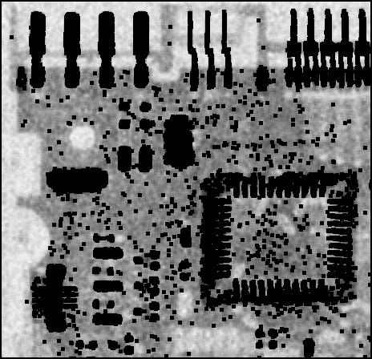

# HW4: Image Restoration and Color Image Processing

## 1 Exercises

### 1.1 Color Spaces

* **1.1.1 Which model is advantageous**
    * Filtering in HSI color space is more advantages than RGB color space. Filtering in HSI only requires filtering in the luminance (I) color channel. You don’t need to perform filtering in Chrominance channels. However filtering in RGB color space requires filtering in all channels (R, G and B)
    * RGB model is advantageous when used in image capture by a color camer or image display in a monitor screen

* **1.1.2 What is the effect of adding 60 degrees to the Hue components?**
Adding 60 degrees to the Hue components shifts the RGB components such that R becomes Yellow, G becomes Cyan and B becomes Magenta. It means to perform an RGB to CMY conversion.

### 1.2 Color Composition

 
Set the intersection between line $c_3c$ and line $c_1c_2$ as $c_0$. So line $c_1c_2$ can be expressed as
$$
y-y_1=\frac{y_1-y_2}{x_1-x_2} \times (x-x_1)
$$
and line $c_3c$ can be expressed as
$$
y-y_c=\frac{y_c-y_3}{x_c-x_3} \times (x-x_c)
$$
So the coordinates $(x_0, y_0)$ of $c_0$ should be able to calculated from the above two equation. 
We note $d(a, b)$ as the distance between point $a$ and $b$, which can be expressed as:
$$
d(a, b) = \sqrt{(x_a-x_b)^2+(y_a-y_b)^2}
$$
So the percentage $p_3$ of $c_3$ in $c$ can be expressed as:
$$
p_3 = \frac{d(c_0, c_3) - d(c, c_3)}{d(c_0, c_3)} \times 100
$$
And the percentage $p_1$ of $c_1$ in $c$ and $p_2$ of $c_2$ in $c$ and be calculated from the following two equations:
$$
p_1 + p_2 = 100 - p_3 \\
\frac{p_1}{p_2} = \frac{d(c_0, c_2)}{d(c_0, c_1)}
$$
And that's all for the expressions.

## 2 Programming Tasks

### 2.2 Image Filtering

 
Original Image

* **2.2.1 arithmetic mean filters**

 
Using 3x3 arithmetic mean filter

 
Using 9x9 arithmetic mean filter

The images are all blurred

* **2.2.2 harmonic mean filters**

 
Using 3x3 harmonic mean filter

 
Using 9x9 harmonic mean filter

The white bars in the image which used 3x3 filter becomes shorter and thiner and the size of the white bars should be (222, 6) 
There is no white bars in the image which used 9x9 filter.

* **2.2.3 contraharmonic mean filters with Q = −1.5**

 
Using 3x3 contraharmonic mean filter

 
Using 9x9 contraharmonic mean filter

The same as 2.2.2

### 2.3 Image Denoising

 
input image for task 2

* **2.3.2 Add Gaussian noise and denoise**

 
Add Gaussian noise with mean = 0 and sigma = 40

 
Denoise using arithmetic mean filter with size = 5

 
Denoise using geometric mean filter with window size = 5

 
Denoise using median filter with window size = 5

The one with arithmetic mean filter looks best, while the one with geometric mean fitler looks worest.

* **2.3.3 Add salt noise and denoise**

 
Add salt noise with probability = 0.2

 
Denoise using harmonic mean filter with windown size as 5

 
Denoise using contraharmonic mean filter with $Q=-1.5$ and window size as 5

 
Denoise using contraharmonic mean filter with $Q=1.0$ and window size as 5

* **2.3.4 Add salt-and-pepper noise and denoise**

 
Add salt and pepper noise with both probabilities=2

 
Denoise using arithmetic mean filter with window size as 5

 
Denoise using geometric mean filter with window size as 5

 
Denoise using max filter with window size as 5

 
Denoise using min filter with window size as 5

 
Denoise using median filter with window size as 5

The image with median filter gets the best result.

### 2.4 Histogram Equalization on Color Images

 
Original Image for task 3

* **2.4.1 Processing the R, G, B channels separately**

 

* **2.4.2 Using a single histogram equalization intensity transformation function**

 

* **2.4.3 Compare the above results**

The result get from *2.4.2* is much **better** than *2.4.1*
