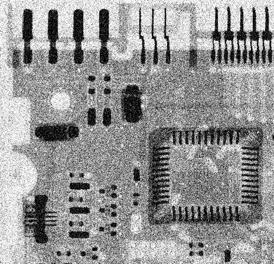
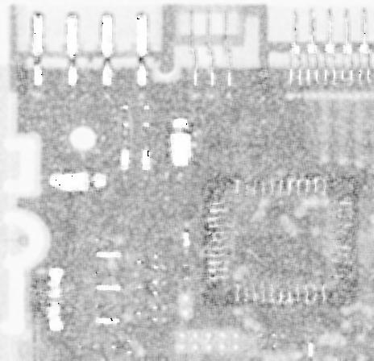
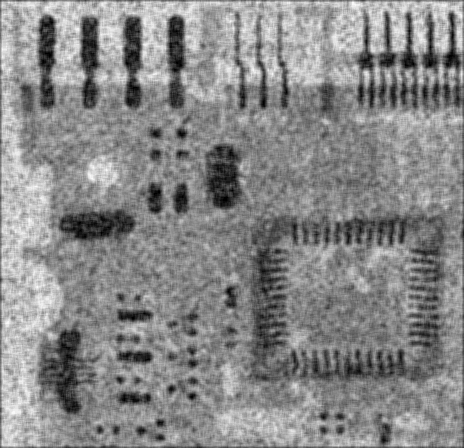
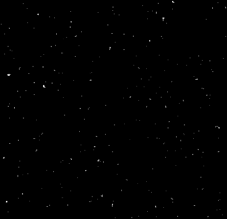
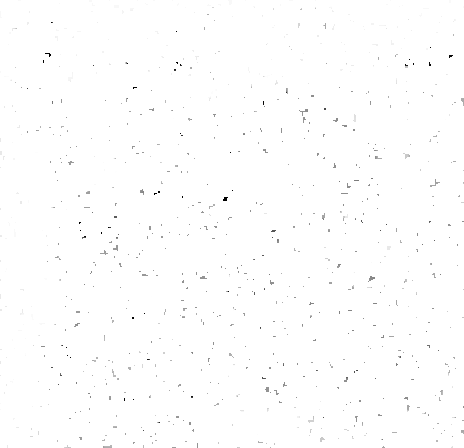
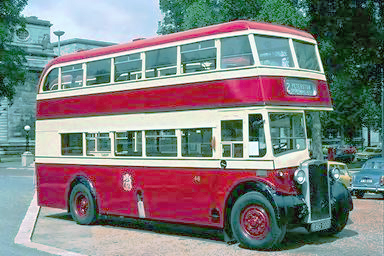

# HW4: Image Restoration and Color Image Processing

## 1 Exercises

### 1.1 Color Spaces

**1.1.1** 
结合6.2.3节中的图6.13，我们可以得知该图像的色调(Hue)分量依次是
$$
H =
\begin{bmatrix}
    \frac{1}{6}  & \frac{5}{6}  \\
    \frac{1}{2}  & \frac{1}{3}
\end{bmatrix}
$$
0为纯黑色，1为纯白色，以此来确定上述矩阵对应的灰度图 
饱和度的公式为:
$$
S = 1 - \frac{3}{(R+G+B)}[min(R, G, B)]
$$
由于四个颜色的RGB分量中的最小值都是0，可知它们都是饱和色，所以他们的饱和度(Saturation)分量都是1，是一张纯白色的图 
最后，强度(Intensity)分量的计算公式为 
$$
I = \frac{1}{3}(R+G+B)
$$
所以其强度分量依次是
$$
I =
\begin{bmatrix}
    \frac{2}{3}  & \frac{2}{3}  \\
    \frac{2}{3}  & \frac{1}{3}
\end{bmatrix}
$$
同理，0为纯黑色，1为纯白色，以此来确定上述矩阵对应的灰度图 
**1.1.2** 
该图的饱和度通道的数值都是常量1，所以，对其应用算术平均滤波之后，得到的结果仍然是原图。 
**1.1.3** 
对于色调通道，由于每个方块都是常量，所以，如果整个滤波器都落在一个方块区域中，那么得到的结果仍是该常量。但是，在区域的交界处，滤波后会改变它们的值，这个值的大小，取决于每个区域在滤波器中所占的比重。所以，在区域的交界处，会呈现一个渐变的效果，从一个色调逐渐变换到另一个色调。 

## 2 Programming Tasks

### 2.2 Image Filtering

 
原图

**2.2.1 arithmetic mean filters**

 
使用 3x3 算术均值滤波器

 
使用 9x9 算术均值滤波器

图像变得模糊了，而且使用9x9的滤波器得到的结果比使用3x3得到的结果更模糊。

**2.2.2 harmonic mean filters**

 
使用 3x3 几何均值滤波器

 
使用 9x9 几何均值滤波器

使用3x3的滤波器得到的图像中，白条变得更瘦更短了，并且每个白条的大小应该是(222, 6) 
使用9x9的滤波器得到的图像中，不存在白条。由于几何均值滤波进行了累乘运算，而白条的宽为8，对于9x9的滤波器，其对应的图像块中一定存在黑色(值为0)像素，所以最终得到的必定全是0。

**2.2.3 contraharmonic mean filters with Q = −1.5**

 
使用 3x3 Q=1.5的逆谐波均值滤波器

 
使用 9x9 Q=1.5的逆谐波均值滤波器

得到的结果大致上与2.2.2中相同

### 2.3 Image Denoising

 
原图

**2.3.2 Add Gaussian noise and denoise**

 
加了均值为0，标准差为40的高斯噪声后的图像

 
使用5x5的算术均值滤波器去噪后的图像

 
使用5x5的几何均值滤波器去噪后的图像

 
使用5x5的中值滤波器去噪后的图像

使用算术均值滤波器得到的结果最好，使用几何均值滤波器得到的结果最差。

**2.3.3 Add salt noise and denoise**

 
加了概率为0.2的盐噪声后的图像

 
使用5x5的谐波滤波器去噪后的图像

 
使用5x5的 $Q=-1.5$ 逆谐波滤波器去噪后的图像

 
使用5x5的 $Q=1.0$ 逆谐波滤波器去噪后的图像

**2.3.4 Add salt-and-pepper noise and denoise**

 
加了概率都为0.2的椒和盐噪声后的图像

 
使用5x5的算术均值滤波器去噪后的图像

 
使用5x5的几何均值滤波器去噪后的图像

 
使用5x5的最大值滤波器去噪后的图像

 
使用5x5的最小值滤波器去噪后的图像

 
使用5x5的中值滤波器去噪后的图像

显然，中值滤波器得到的效果最好

**2.3.5 Discuss how you implement all the above filtering operations**

### 2.4 Histogram Equalization on Color Images

 
原图

**2.4.1 Processing the R, G, B channels separately**

 

**2.4.2 Using a single histogram equalization intensity transformation function**

 

**2.4.3 Perform histogram equalization on intensity channel**

**2.4.4 Compare the above results**
