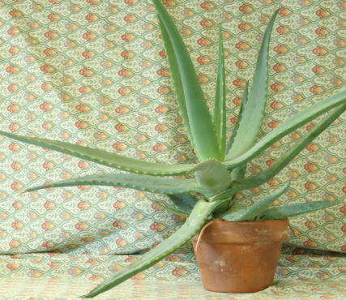
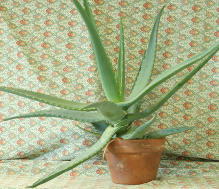
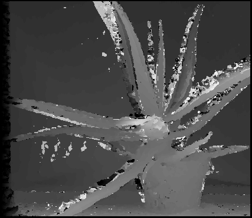

# Final Project: Stereo Matching

## 2.1 Basic Task

### 2.1.1 Implement a test program to evaluate the quality of your disparity maps

Just count the number of bad pixel of the generated disparity map, which means the difference of disparity is larger than one in compare to the ground truth, and then, divided by the size of the disparity map. The implement can be found in function `compareFn` in the file *main.cpp* 
The following shows the bad pixel percentage of all examples. 
| Name | SSD[L] |NCC[L] |ASW[L] |SGM[L] |SSD[R] |NCC[R] |ASW[R] |SGM[R] |
|:-------:|:-------:|:-------:|:-------:|:-------:|:-------:|:-------:|:-------:|:-------:|
| Aloe | 26.352% | 25.714% | 26.224% | 22.81% | 27.215% | 26.492% | 26.833% | 24.384% |
| Baby1 | 32.306% | 28.1% | 42.32% | 31.302% | 32.452% | 28.11% | 41.762% | 31.584% |
| Baby2 | 37.844% | 37.214% | 48.351% | 37.541% | 38.767% | 38.104% | 48.482% | 38.355% |
| Baby3 | 42.453% | 39.94% | 50.624% | 42.138% | 41.277% | 39.461% | 49.411% | 41.81% |
| Bowling1 | 58.149% | 45.066% | 70.414% | 67.046% | 57.749% | 45.446% | 71.126% | 68.104% |
| Bowling2 | 40.857% | 42.039% | 50.577% | 49.251% | 40.513% | 42.526% | 50.503% | 49.583% |
| Cloth1 | 12.712% | 12.959% | 18.866% | 10.53% | 10.814% | 11.073% | 17.246% | 8.9215% |
| Cloth2 | 30.94% | 23.389% | 34.722% | 31.265% | 31.72% | 24.611% | 35.008% | 31.873% |
| Cloth3 | 18.432% | 17.109% | 20.337% | 15.437% | 16.314% | 15.501% | 18.716% | 14.03% |
| Cloth4 | 24.618% | 21.763% | 26.811% | 22.361% | 26.782% | 23.318% | 28.504% | 24.449% |
| Flowerpots | 53.952% | 59.127% | 58.344% | 57.234% | 54.711% | 60.395% | 58.057% | 57.303% |
| Lampshade1 | 56.146% | 50.008% | 62.559% | 57.576% | 54.513% | 49.71% | 61.808% | 56.621% |
| Lampshade2 | 67.269% | 51.288% | 74.645% | 71.377% | 65.58% | 50.359% | 74.178% | 71.361% |
| Midd1 | 58.611% | 58.656% | 63.028% | 59.473% | 58.171% | 59.18% | 63.004% | 59.632% |
| Midd2 | 63.217% | 60.366% | 71.377% | 69.935% | 63.408% | 60.975% | 72.214% | 71.179% |
| Monopoly | 65.963% | 51.475% | 78.607% | 67.683% | 65.189% | 50.225% | 78.683% | 66.624% |
| Plastic | 79.797% | 78.528% | 81.326% | 79.658% | 79.455% | 78.999% | 82.356% | 80.221% |
| Rocks1 | 26.443% | 22.172% | 31.713% | 23.308% | 25.496% | 21.355% | 30.874% | 22.787% |
| Rocks2 | 23.437% | 20.481% | 31.134% | 23.321% | 22.053% | 18.95% | 29.779% | 21.791% |
| Wood1 | 35.647% | 33.377% | 48.593% | 40.933% | 34.108% | 33.376% | 47.51% | 40.092% |
| Wood2 | 40.888% | 29.122% | 53.071% | 47.936% | 41.198% | 29.314% | 52.684% | 48.67% |

 
Left Image(Aloe) 
 
Right Image(Aloe) 
 
Ground truth of left disparity map(Aloe) 
 
Ground truth of right disparity map(Aloe) 
**Caution:** In what follows, without extra mention, only result of the first example(Aloe) will be presented since size is limited. The results of all the examples can be found [here](https://drive.google.com/file/d/0BwFktEM1WILoSFUtNmh1dGhFR2s/view?usp=sharing)

### 2.2.2 Implement a local stereo matching algorithm using “Sum of Squared Difference (SSD)” as matching cost.

 
Left disparity map by using **SSD**

 
Right disparity map by using **SSD**

The quality of two disparity maps can be found in the above table, labeled as **Aloe SSD[L]** and **Aloe SSD[R]**, respectively.

### 2.2.3 Implement a local stereo matching algorithm using “Normalized Cross Correlation (NCC)” as matching cost.

 
Left disparity map by using **NCC**

 
Right disparity map by using **NCC**

The quality of two disparity maps can be found in the above table, labeled as **Aloe NCC[L]** and **Aloe NCC[R]**, respectively.

In image processing, the normalized cross correlation of a template, $t(x, y)$ with a subimage $f(x, y)$ is
$$
{\frac {1}{n}}\sum _{x,y}{\frac {(f(x,y)-{\overline {f}})(t(x,y)-{\overline {t}})}{\sigma _{f}\sigma _{t}}}
$$
Reference: [Cross Correlation Wikipedia](https://en.wikipedia.org/wiki/Cross-correlation)

### 2.2.4 Add a small constant amount of intensity (e.g. 10) to all right eye images, and re-run the above two methods.

 
Left disparity map by using **SSD** after **adding 10** to right eye image's intensity 
 
Left disparity map by using **NCC** after **adding 10** to right eye image's intensity 
 
Right disparity map by using **SSD** after **adding 10** to right eye image's intensity 
 
Right disparity map by using **NCC** after **adding 10** to right eye image's intensity 

Obviously **NCC** performs much better than **SSD**, that is, the robustness of **NCC** is better than **SSD** on such condition. The reason is that **NCC** normolized the image before doing other calculations. Since adding a small constant amount of intensity to an image will not change the distribution of the intensity of an image, it would remain almost the same as before after normolization. But adding a constant amount of intensity to one of the image would absolutely affect the squared difference a lot, that is why **SSD** failed.

### 2.2.5 Implement a local stereo matching algorithm using “Adaptive Support Weight (ASW)” as matching cost.

 
Left disparity map by using **ASW**

 
Right disparity map by using **ASW**

The quality of two disparity maps can be found in the above table, labeled as **Aloe ASW[L]** and **Aloe ASW[R]**, respectively.

**Caution:** The algorithm is really very slow without well optimization in implement. In my computer, it takes about 450 seconds to generate a disparity map.

**Reference:**
[Locally adaptive support-weight approach for visual correspondence search](http://ieeexplore.ieee.org/document/1467541/)

### 2.2.6 Explain the idea of the ASW paper in question 5. Also explain in which ways ASW is better than NCC. Why?

### 2.2.7 Implement a glocal stereo matching algorithm using “Semi-Global stereo matching (SGM)” as matching cost.

 
Left disparity map by using **SGM** 
 
Right disparity map by using **SGM** 

The pixel cost is calculated by using sum of absolute differences on 5 × 5 patches. I implement the up-to **16 paths** version(2, 4, 8 paths are also supported in my code) and of course, in this task, the matching cost is aggrated along 16 paths in order to get better result.The SMALL_PENALTY is set as 3 and LARGE_PENALTY is set as 20 empirically. Check out the `SGMMatch` class for more detail. 
**Caution:** The implement of this algorithm is memory consuming, it takes about **0.9G** in my machine when running. 
**Reference:**
* Hirschmüller, H., Accurate and Efficient Stereo Processing by Semi-Global Matching and Mutual Information, IEEE Conference on Computer Vision and Pattern Recognition, June 2005
* Hirschmüller, H., Stereo Processing by Semiglobal Matching and Mutual Information, IEEE Transactions on pattern analysis and machine intelligence, Vol. 30, No. 2, February 2008

### 2.2.8 Explain the main differences between local stereo approaches and SGM.
